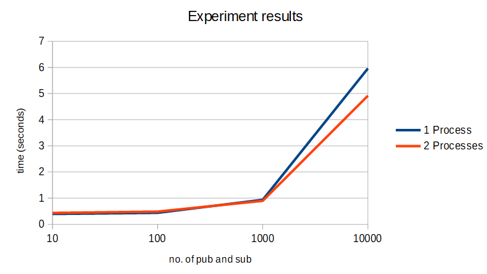

# EBS Homework

## Config file example

```json
{
    "publications": 1000,
    "subscriptions": 1000,
    "constraints": [
        {
            "type": "frequency",
            "field": "temperature",
            "percent": "=80"
        },
        {
            "type": "frequency",
            "field": "stationid",
            "percent": "=70"
        },
        {
            "type": "operator",
            "field": "temperature",
            "operator": ">",
            "percent": "=80"
        },
        {
            "type": "operator",
            "field": "stationid",
            "operator": "<",
            "percent": "=20"
        }
    ],
    "threads": 2
}
```

## Experiment

### Setup

We ran each experiment 10 times, with different values for the following parameters:

- the number of subscriptions and publications (10, 100, 1000, 10000)
- the numer of processes used for the generation (1, 2)

The experiments were ran on a machine with the following specifications:

- Intel Core i7 8700 3.2 GHz CPU
- 32GB RAM (2666 MHz)

### Results

| Processes \\ no. of pub and sub | 10                 | 100                 | 1000               | 10000             |
|---------------------------------|--------------------|---------------------|--------------------|-------------------|
| 1                               | 0.3944056034088135 | 0.4379286766052246  | 0.9365413188934326 | 5.961461067199707 |
| 2                               | 0.4357736110687256 | 0.48509669303894043 | 0.8964056968688965 | 4.917885780334473 |

<p align="center">
  
</p>